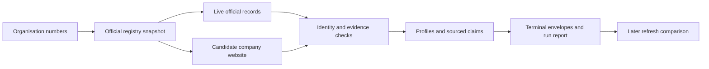

# Signalpost

**Company research with a source for every claim.** I built Signalpost to turn a Norwegian organisation number into a research profile I can inspect, refresh, and audit. It combines official registry and accounts data with carefully verified company website evidence. When a source is missing or the company match is uncertain, it says so instead of inventing a result.

This repository contains a **runnable command-line agent**, not a hosted web app. It processes a batch of organisation numbers and writes company profiles, evidence-backed result envelopes, and a run report. The default path requires no paid API key or hosted language model.

**Latest live check (6 October 2026):** 100/100 terminal results in 142 seconds with 637 reported requests. One company website returned HTTP 429 and was marked failed; see [Validation](VALIDATION.md) for the run report and limits.

## What it does

1. **Anchor the legal entity** in a downloaded Brønnøysund Register Centre company snapshot. The organisation number remains the primary identifier throughout the run.
2. **Research the company** using public registry, annual accounts, roles, group, and workplace records. It checks a registered website when one exists.
3. **Gate external claims** against exact legal-entity evidence. A parent, brand, franchise, or similarly named company is not silently treated as the target company.
4. **Write an auditable result** with source URLs, retrieval times, reporting periods, content hashes, claim spans, availability states, and a summary linked to claim IDs.
5. **Refresh without false withdrawals** by comparing a new run with earlier envelopes. Unavailable sources and bounded scans do not become claims that a job or activity disappeared.

The optional Brave Search and NAV job-feed connectors are disabled in the default command. They require separate access and have narrower validation than the core registry path; see [source and access notes](SOURCE_POLICY.md).



## Run it

Requirements: Python 3.12+, [uv](https://docs.astral.sh/uv/), and network access to the public sources. From the repository root:

```bash
curl --fail --location --retry 3 --continue-at - \
  'https://data.brreg.no/enhetsregisteret/api/enheter/lastned/csv' \
  --output brreg-enheter.csv.gz

./run_signalpost.sh agent/data/dev10.jsonl brreg-enheter.csv.gz out/dev10 10
```

The download is an official company snapshot. It is large and is intentionally excluded from Git. The ten input organisations are in [`agent/data/dev10.jsonl`](agent/data/dev10.jsonl). You can provide your own JSONL file with one `{"organisation_number":"923609016"}` object per line, then set the final argument to its line count. The script uses pinned dependencies from `agent/uv.lock` and accepts absolute or repository-relative paths.

The output directory contains:

| File | Purpose |
| --- | --- |
| `profiles.jsonl` | Working profiles with source observations. Keep locally; these may include fetched page excerpts. |
| `envelopes.jsonl` | One terminal, evidence-backed result per input organisation. |
| `run-report.json` | Count, runtime, requests, declared API cost, and structural validation. |

You can also ask a question about a profile. The answer layer returns only source-linked facts and marks unsupported topics:

```bash
cd agent
uv run --frozen python scripts/ask_agent.py \
  --input ../out/dev10/profiles.jsonl \
  --org 917805717 \
  --question 'What is its revenue?'
cd ..
```

See a [source-linked example answer](examples/sample-answer.json) from the October 2026 live check.

To check the same batch again and record material changes, pass the earlier envelopes as the fifth argument:

```bash
./run_signalpost.sh agent/data/dev10.jsonl brreg-enheter.csv.gz out/dev10-refresh 10 out/dev10/envelopes.jsonl
```

For a 100-company smoke run, use `agent/data/holdout100.jsonl` and `100` as the expected count. A new run fetches current live responses, so availability, claim counts, and runtime can change.

## Check it without network access

The saved-data replay checks two known changes, evidence preservation, and an unchanged rerun:

```bash
cd agent
uv run --frozen python first_run.py
uv run --frozen python -m unittest discover -s tests -q
```

The latest local results and their limits are in [Validation](VALIDATION.md). The actual envelope fields and six availability states are documented in [Output contract](agent/OUTPUT_CONTRACT.md).

## Design choices and limits

- **Deterministic publication:** the terminal identity and claim path does not call a hosted model. The summary is built from verified claims and cites their IDs.
- **Honest absence:** `not_available`, `blocked`, `not_applicable`, `ambiguous`, and `failed` are distinct from `available`. A missing company website or unqueried jobs feed is not evidence of no website or jobs.
- **Source boundaries:** site requests follow robots policy and block private or reserved network destinations and unsafe redirects. Optional search output only proposes URLs; a fetched exact-company page must provide the evidence.
- **Coverage:** the default path is strongest on official company records. It does not establish broad website, job, news, or social coverage. A successful local run is not a measured external recall or independent precision score.
- **Operation:** this is a local batch tool. Deployment, scheduling, a public UI, and third-party monitoring are not included in this repository.

## Project layout

```text
run_signalpost.sh             one-command batch entry point
agent/src/norway_company_agent/   research, identity, evidence, refresh, summaries
agent/scripts/run_batch.py    batch orchestration
agent/data/                   small input samples
agent/tests/                  saved-source and unit checks
VALIDATION.md                 measured results and open checks
SOURCE_POLICY.md              source, licence, key, and cost boundaries
```

**Origin and versioning.** I developed this project from Builderr's public Signalpost starter kit; that origin is retained here. The historical challenge version remains available at the exact commit [`ef2455b`](https://github.com/divyanshAgarwal123/signalpost-company-research-agent/tree/ef2455bc6017e0962b4681f7e2bbef41fe3dcd7b). This maintained branch removes the old prize and submission planning material. A commit-pinned challenge submission is evaluated against its own frozen revision, so updates to `main` do not rewrite that revision. Current participation requirements belong to [Builderr's challenge page](https://builderr.ai/challenges/signalpost) and [evaluation contract](https://builderr.ai/docs/signalpost-evaluation-harness.md); this README does not claim acceptance or a score.

Built by [Divyansh Agarwal](https://github.com/divyanshAgarwal123).
